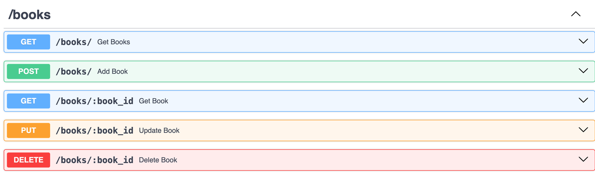

# Controllers in PyNest 🚀

The Controller decorator in PyNest is used to define a controller, which is a class responsible for handling incoming requests and returning responses to the client. Controllers register routes in the application and manage request and response objects, effectively acting as the gateway through which clients interact with your application.

## Defining a Controller

To create a basic controller in PyNest, use the @Controller decorator.
This decorator is required to define a controller and specify an optional route path prefix,
which helps group related routes and minimize repetitive code.

```python
from nest.core import Controller, Get, Post

@Controller('/books')
class BookController:
    def __init__(self, book_service: BookService):
        self.book_service = book_service

    @Get('/')
    def get_books(self):
        return self.book_service.get_books()

    @Post('/')
    def add_book(self, book):
        self.book_service.add_book(book)
        return {"message": "Book added successfully!"}
```

In the example above:

The `@Controller('/books')` decorator defines a controller with the prefix `/books`.

The `BookController` class handles HTTP `GET` requests to `/books` and `POST` requests
to `/books` using the `@Get` and `@Post` decorators,
respectively.

The `BookService` dependency is injected into the BookController to handle the business logic.

## Routing

Routing is the mechanism that controls which controller receives which requests.
Each controller can have multiple routes, and different routes can perform different actions.

### Example
```python
from nest.core import Controller, Get

@Controller('/cats')
class CatsController:
    @Get('/')
    def find_all(self):
        return 'This action returns all cats'
```

In this example:

The `@Controller('/cats')` decorator specifies the route path prefix for the `CatsController`.
The `@Get('/')` decorator creates a handler for the HTTP `GET` requests to `/cats`.
When a `GET` request is made to `/cats`, the find_all method is invoked, returning a string response.

## Creating Controllers Using the CLI (In Progress!)

To create a controller using the PyNest CLI, execute the following command:

```bash
pynest generate controller <controller_name>
```

For example, to create a BooksController, you would run:

```bash
pynest generate controller books
```

## Handling Requests and Responses

Controllers in PyNest handle HTTP requests and responses through various decorators
that correspond to HTTP methods like GET,
POST, PUT, DELETE, etc.

### Example

```python
from nest.core import Controller, Get, Post, Put, Delete
from .book_service import BookService
from .book_models import Book

@Controller('/books')
class BooksController:
    def __init__(self, book_service: BookService):
        self.book_service = book_service

    @Get('/')
    def get_books(self):
        return self.book_service.get_books()

    @Get('/:book_id')
    def get_book(self, book_id: int):
        return self.book_service.get_book(book_id)

    @Post('/')
    def add_book(self, book: Book):
        self.book_service.add_book(book)
        return {"message": "Book added successfully!"}

    @Put('/:book_id')
    def update_book(self, book_id: int , book: Book):
        self.book_service.update_book(book_id, book)
        return {"message": "Book updated successfully!"}

    @Delete('/:book_id')
    def delete_book(self, book_id: int):
        self.book_service.delete_book(book_id)
        return {"message": "Book deleted successfully!"}
```

When we will go to the docs, we will see this api resource - 



## Best Practices

* Keep Controllers Focused: Controllers should only handle HTTP requests and delegate business logic to services.
* Use Dependency Injection: Inject services into controllers to manage dependencies effectively.
* Group Related Routes: Use route path prefixes to group related routes and minimize repetitive code.


## Conclusion 🎉
Controllers are essential components in PyNest applications, managing the flow of requests and responses. By defining clear routes and leveraging the power of decorators, you can build efficient and maintainable endpoints for your application. Happy coding!


---

<nav class="md-footer-nav">
  <a href="/PyNest/modules" class="md-footer-nav__link">
    <span>&larr; Modules</span>
  </a>
  <a href="/PyNest/providers" class="md-footer-nav__link">
    <span>Providers &rarr;</span>
  </a>
</nav>