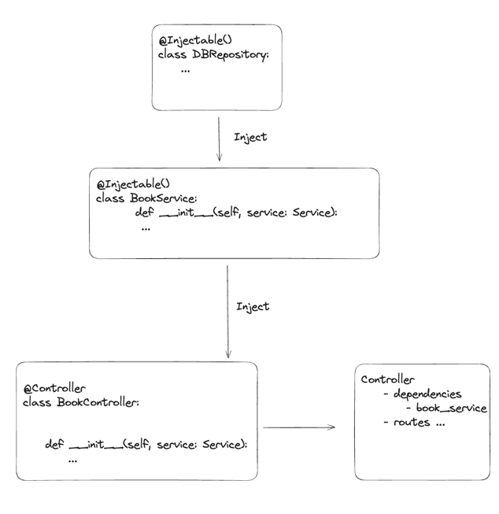

# Dependency Injection in PyNest 🛠️

## Overview

Dependency Injection (DI) is a design pattern that promotes the construction of dependent objects outside of a class and provides those objects to a class through various means. This pattern facilitates loose coupling, enhancing testability and maintainability. In the realm of Python web frameworks, PyNest and FastAPI represent two distinct approaches to DI. This guide delves into PyNest's DI system, comparing it to FastAPI, and highlights its advantages, particularly for larger applications.

## What is Dependency Injection?

Dependency Injection is a technique where an object receives its dependencies from an external source rather than creating them itself. This promotes loose coupling and enhances testability and maintainability.

## PyNest: A Modular DI Approach

PyNest provides a structured DI system that enables dependencies to be injected at the controller class level. This promotes code reusability and adherence to the DRY (Don't Repeat Yourself) principle. Once a dependency is injected into a controller, it can be used across all the controller's route methods without needing further injection, thus simplifying the codebase.

## Using DI in PyNest

### Defining a Provider

```python
# logger_service.py
from nest.core import Injectable

@Injectable
class LoggerService:
    def log(self, message: str):
        print(f"LOG: {message}")
```

### Creating a Module
```python
# logger_module.py
from nest.core import Module
from .logger_service import LoggerService

@Module(
    providers=[LoggerService],
    exports=[LoggerService],
)
class LoggerModule:
    pass
```

### Injecting the Provider into a Controller
```python
# app_controller.py
from nest.core import Controller, Get
from src.providers.logger.logger_service import LoggerService

@Controller('/')
class AppController:
    def __init__(self, logger_service: LoggerService):
        self.logger_service = logger_service

    @Get('/log')
    def log_message(self):
        self.logger_service.log("Hello, PyNest!")
        return {"message": "Logged successfully"}
```

### Creating the Application Module
```python
# app_module.py
from nest.core import Module
from src.providers.logger.logger_module import LoggerModule
from arc.providers.logger.logger_service import LoggerService
from .app_controller import AppController

@Module(
    imports=[LoggerModule],
    controllers=[AppController],
   providers=[LoggerService],
)
class AppModule:
    pass
```

In this example, we saw how to define a provider, create a module that exports the provider, inject the provider into a controller, and create an application module that imports the provider module and registers the controller.

## Key Features of PyNest DI

1. **Injectable Objects**: 
Injectable objects can inject other injectable objects, creating a unified hierarchy of dependencies.

2. **Controller Injection**: 
Controllers can inject injectable objects, allowing them to delegate responsibilities to services and repositories.

3. **Acyclic Dependency Graph**:
Dependencies must form a Directed Acyclic Graph (DAG), avoiding circular dependencies to maintain a manageable dependency resolution process.

4. **Dependency Resolution and Management**:
During the initialization of the application, the IoC (Inversion of Control) container resolves all dependencies, creates instances of objects that haven't been registered yet, and manages those instances.

5. **Exporting Providers**:
A module can export providers, which can then be used or injected by other modules within the application.

6. **Inter-Module Provider Injection**:
For a module to inject a provider from another module, it must explicitly import the module containing the desired provider.

7. **Global Modules**:
There are global modules whose providers are available to the entire application, facilitating shared functionalities.

8. **Controlled Provider Accessibility**:
A module provider can be utilized in another module only if it is exported by the first module, ensuring encapsulation and control over the exposure of services.

9. **Instance Referencing and Reuse**:
When an injected provider is called, it references the existing instance, preventing unnecessary instance creation and adhering to patterns like Singleton.



> This diagram illustrates the Dependency Injection system in PyNest, showcasing the relationships between providers and controllers.

## PyNest vs. FastAPI: Dependency Injection Approaches Compared

### FastAPI: Function-Level DI
In FastAPI, DI is handled using the Depends keyword in the function signature of the route handler. This requires injecting dependencies at the function level for each route, leading to potentially repetitive code.

Example in FastAPI
```python
from fastapi import Depends, FastAPI

app = FastAPI()

# Dependency function
async def common_parameters(q: str = None, skip: int = 0, limit: int = 100):
    return {"q": q, "skip": skip, "limit": limit}

# Route that uses the dependency
@app.get("/items/")
async def read_items(commons: dict = Depends(common_parameters)):
    return commons
```
In this example, `common_parameters` is a dependency function that is executed before read_items whenever the `/items/` route is accessed.

### Comparison

**Redundancy**

`FastAPI`: Requires dependencies to be injected at each route, leading to repetitive and verbose code. For example, if multiple routes require the same dependency, it must be injected into each route handler function separately. This can become cumbersome in larger applications.

`PyNest`: Allows injecting dependencies once at the controller level. Once a dependency is injected into a controller, it can be used across all the controller's route methods without the need for further injection, reducing redundancy and simplifying the codebase.

**Dependency Chains**

`FastAPI`: Supports hierarchical dependencies, but they are resolved at the function level rather than at the controller level. 
This can limit the framework's ability to handle complex dependency chains in a streamlined and DRY manner.

`PyNest`: Supports more complex dependency chains within its modules.
Controllers can inject services, which can then inject providers, and so on, creating a clean and manageable structure. 
This cascading injection is managed through PyNest's module system, resulting in a tidy codebase.

**Modularity**

`FastAPI`: Emphasizes explicitness, requiring every function to declare its dependencies directly. 
While this can improve clarity, it can also increase the amount of boilerplate code, 
making FastAPI less ideal for larger, more complex applications where DI needs to be managed efficiently.

`PyNest`: Emphasizes modularity, with dependencies managed through modules. This approach reduces boilerplate code and promotes a more organized and maintainable codebase.
Modules can export providers, which can then be used or injected by other modules within the application, enhancing reusability and encapsulation.

### Conclusion: Why PyNest May Be Preferable for DI

PyNest's approach to DI provides clear advantages in terms of code organization and maintainability, especially for larger projects where modularity and avoidance of repetition are critical.
By allowing dependencies to be injected at higher levels within the application's structure, 
PyNest facilitates a more DRY codebase, reduces the potential for errors, and streamlines the process of refactoring and testing.

In contrast, while FastAPI's DI system has its strengths, its function-level injection requirement can introduce verbosity and redundancy,
potentially affecting the maintainability and scalability of web applications as they grow in complexity.

Happy coding! 🚀

---

<nav class="md-footer-nav">
  <a href="/PyNest/providers" class="md-footer-nav__link">
    <span>&larr; Providers</span>
  </a>
  <a href="/PyNest/docker" class="md-footer-nav__link">
    <span>Deploy with Docker &rarr;</span>
  </a>
</nav>