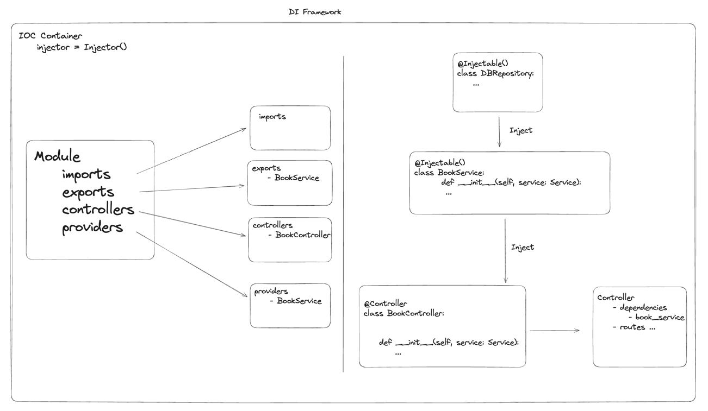

# Modules in PyNest 📦

A module is a class annotated with a `@Module()` decorator. The `@Module()` decorator provides metadata that PyNest uses to organize the application structure.

Each application has at least one module, a root module.
The root module is the starting point PyNest uses
to build the application-graph which is the internal data structure PyNest uses
to resolve module and provider relationships and dependencies.
While very small applications may theoretically have just the root module, this is not the typical case.
Modules are strongly recommended as an effective way to organize your components.
Thus, for most applications, the resulting architecture will employ multiple modules,
each encapsulating a closely related set of capabilities.

## Defining a Module

The `@Module()` decorator takes a single object whose properties describe the module:

- **providers**: The providers that will be instantiated by the PyNest injector and that may be shared across this module.
- **controllers**: The set of controllers defined in this module which have to be instantiated.
- **imports**: The list of imported modules that export the providers which are required in this module.
- **exports**: The subset of providers that are provided by this module and should be available in other modules that import this module. You can use either the provider itself or just its token (provide value).

---


> This diagram shows the relationship between modules, providers, and controllers in a PyNest application.

---

**Code Example**

```python
from pynest.core import Module
from .book_controller import BookController
from .book_service import BookService

@Module({
    'controllers': [BookController],
    'providers': [BookService],
    'exports': [BookService],
})
class BookModule:
    pass
```

In the example above, we define a `BookModule` module that exports the `BookService`.
This means that all the routes in the controllers will be registered in the application,
and the `BookService` will be available for injection in other modules that import the `BookModule`.

## Module Interactions
Modules interact with each other primarily through their exports and imports.
A module can use a provider from another module if the provider is exported by the first module
and the second module imports it.

### Example
```python
from pynest.core import Module
from .book_module import BookModule

@Module({
    'imports': [BookModule],
})
class AppModule:
    pass
```

In this example, the `AppModule` imports the `BookModule`, which means that all the providers exported by the `BookModule` are available in the `AppModule`.

## Global Modules
Global modules provide a set of providers that should be available across the entire application without needing to import the module in every module's import array.

```python
from pynest.core import Module
from .shared_service import SharedService

@Global()
@Module({
    'providers': [SharedService],
    'exports': [SharedService],
    'is_global': True,
})
class SharedModule:
    pass
```

Global modules should be registered only once, typically by the root or core module. This approach reduces boilerplate and makes the application more maintainable.

---

<nav class="md-footer-nav">
  <a href="/PyNest/cli" class="md-footer-nav__link">
    <span>&larr; CLI Usage</span>
  </a>
  <a href="/PyNest/controllers" class="md-footer-nav__link">
    <span>Controllers &rarr;</span>
  </a>
</nav>